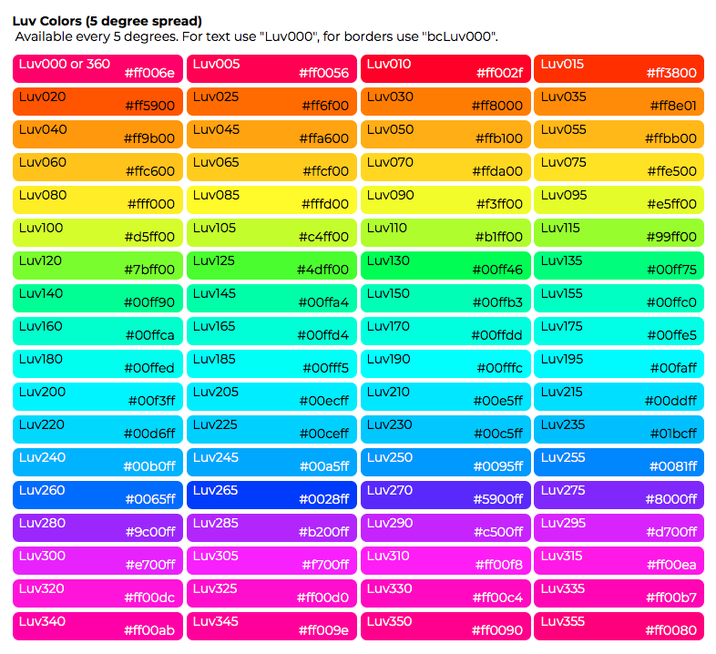

# TinyTrim

A set of CSS generic classes for on-the-fly adjustment of elements without having to add a long style list every time you need to adjust an element like:

    style="lots-of-stuff: #ugh;"

This CSS sheet is mainly for use in development and early design stages, but can be useful for sites where you need a lot of flexibility for special pages.

## Classes

The class names are very terse. For instance, font-size is fs, and setting an element to font-size: 1.2em; is the class **.fs12** setting all margins to 0 is .m0 or setting the top margin to 12px is mt12p  etc.

There's a set of classes for standard HTML color names, plus a set for color and border-color using LuvLCh colors in 5 dgree increments as in Luv015 is Luv 15 degrees, which is red. And a set of colors specifically for background use, all of which are light enough for body text.

There's a brief usage guide in the non-minified version.

## Colors

This is a small subset of Color-eaSSy

### Light Backgrounds

The light backgrounds are for a background for text, including body text. The class name has three parts:

**P L M** meaning Pastel, Light, or Medium

**bg** Obviously for background-color

**R B G** etc for the color ID

Thus **PbgB** is the lightest (pastel) of blue as background-color

### Luv Colors

The Luv colors are useable for text with "Luv000" or border-color with "bcLuv000" where 000 is the three digit hue, in five degree increments starting at 000 through 360 (which is the same as 000).

### HTML Named Colors

The ever so yucky HTML colors are here for ... well, they're here.

Simple class names:

.c is for `color:`, .bg is for `background-color:`, and .bc is for `border-color:`
Each is available by the full name, or one or two shorthands:

Example for Black, showing `color:`,  `background-color:`, and `border-color:`

    .cBlack,    .cBlk, .cBk
    .bgBlack,   .bgBlk,.bgBk
    .bcBlack,   .bcBlk,.bcBk

For the rest, we'll just show `color:`, the others follow the same naming convention.

    .cBrown,    .cBrn, .cBn
    .cNavy,     .cNvy, .cN
    .cBlue,     .cBlu, .cB
    .cYellow,   .cYlw, .cY
    .cRed,      .cR       
    .cOrange,   .cOrg, .cO
    .cTan,      .cTn
    .cMaroon,   .cMrn, .cMn
    .cPurple,   .cPur, .cP
    .cMagenta,  .cMag, .cM
    .cFuchsia,  .cFsh, .cF
    .cOlive,    .cOlv, .cOv
    .cGreen,    .cGrn, .cG
    .cTeal,     .cTea, .cT
    .cLime,     .cLim, .cL, 
    .cAqua,     .cAqu, .cA
    .cGray,     .cGry, .cGy
    .cSilver,   .cSlv, .cS
    .cWhite,    .cWht, .cW      

More to come, stay tuned!

Andy

